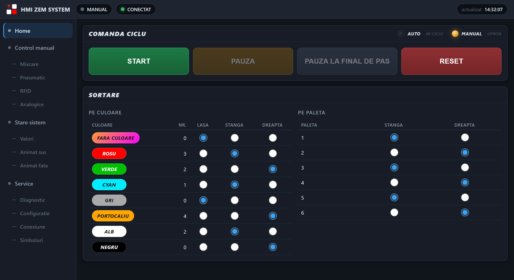

# HMI ZEM System

An operator interface for a Bosch Rexroth ctrlX sorting cell, built as a .NET MAUI Blazor Hybrid
application talking to the controller over OPC UA. It runs on an Android tablet — the primary
target — and on Windows.

It replaces the CODESYS visualization that used to run on the stand's own panel, so that the
interface is no longer tied to the machine it watches.



The Home tab, with the cell stopped: the cycle commands at the top — only the ones that make sense
right now are live — and the sorting rules underneath, one decision per colour and one per pallet.
The rail on the left shows every tab unfolded, so the whole interface is one glance away.

## What the stand does

Three columns hold pallets: left, the belt, right. A storage magazine feeds the belt from the back,
the belt brings pallets to the front, and a single-axis arm with a pneumatic head — gripper, claws
and vacuum, all on one stroke — moves pallets between columns and sorts the objects on them by
colour.

The HMI shows the state of the cell, commands the automatic cycle, and allows manual movements when
the cycle is stopped.

## What is in here

| | |
|---|---|
| `ZEM_BoschRexrothSystemByASTI/Plc/` | the OPC UA layer: session, browse, subscription, typed writes, and an internal simulator |
| `ZEM_BoschRexrothSystemByASTI/Components/` | the four tabs, the panels, and the two animated stand views |
| `ZEM_BoschRexrothSystemByASTI/wwwroot/cell/` | 100 SVG drawings of the stand, stacked as layers |
| `HMI-HANDOFF.md` | the handover document: structure, style decisions, safety rules, the traps already paid for |
| `docs/` | the PLC variables, the logic behind each button, and the operator manual |
| `tools/make-figures.py` | renders `docs/images/` out of the application itself |

The images in `docs/images/` are not mock-ups. The stand is composed from the very SVG layers the
application loads, with the pallets at the positions `StandGeometry` computes; the interface is
rendered with the application's own `app.css` and markup taken from the Razor components. Run
`python tools/make-figures.py` after changing the theme or the drawings, and they follow.

## Two things worth knowing before reading the code

**Values are pushed, not polled.** The loop groups are monitored items in a single OPC UA
subscription; a "read" is a dictionary lookup. Cyclic reading was kept only as a safety net, for
when a server refuses the subscription or stops publishing. A frozen picture has to become a slow
picture, never a wrong one.

**There is no watchdog in the PLC.** A command flag left raised means an axis running into its
travel limit. So the jog and the solenoid valves are press-and-hold, and every flag is dropped when
the page is left, on blur, hide and close, and before any disconnection.

## Build

```bash
dotnet build "ZEM_BoschRexrothSystemByASTI\ZEM_BoschRexrothSystemByASTI.csproj" -f net10.0-windows10.0.19041.0
```

```bash
dotnet build "ZEM_BoschRexrothSystemByASTI\ZEM_BoschRexrothSystemByASTI.csproj" -t:Run -f net10.0-android
```

The application starts without a PLC, on an internal simulator with four pallets already on the
stand — `Service → Conexiune`, tick "Foloseste simulatorul intern". That is enough to see every
screen.

## Documentation

| document | for whom |
|---|---|
| [`docs/USER-MANUAL.md`](docs/USER-MANUAL.md) | the operator, organised around workflows rather than an inventory of the screen |
| [`HMI-HANDOFF.md`](HMI-HANDOFF.md) | whoever takes over development — read this first |
| [`docs/OPCUA-HMI.md`](docs/OPCUA-HMI.md) | the published PLC variables, their types, and what the HMI is allowed to write |
| [`docs/HMI-CONTEXT.md`](docs/HMI-CONTEXT.md) | what the old HMI displayed and what PLC logic sits behind each button |

## A note on language

The repository is written in English. **The interface is in Romanian**, because the stand is
operated in Romanian — so on-screen labels quoted in the documentation are given as they appear.

## Known limitations

Stated here rather than buried, because none of them is finished work:

- **Publishing arrives irregularly.** At a requested 100 ms, values were measured arriving between
  7 and 336 ms apart, averaging 135 ms. `Service → Simboluri` now also shows the sampling interval
  the server granted; if it exceeds the requested one, that is the lead. Not resolved.
- **The pneumatic head still uses the old two-sensor rule**, so a head stuck mid-travel is drawn as
  raised. The pullers were already moved to a rule that draws the intermediate state; the head was
  not.
- **`maui_splash_image.xml` comes out empty** whatever `splash.svg` contains. On Android 12+ it does
  not matter — the system draws the icon on the background colour.

## License

MIT — see [`LICENSE`](LICENSE). Use it, change it, build on it; just keep the copyright notice.

The stand drawings in `wwwroot/cell/` come from the machine's original CODESYS visualization and
depict Bosch Rexroth hardware. They are included because the application does not run without them.
